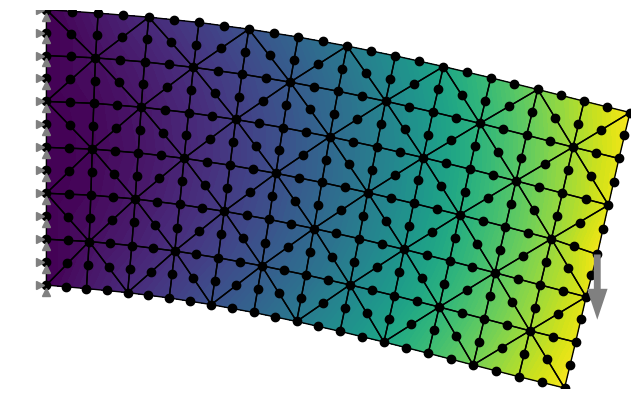
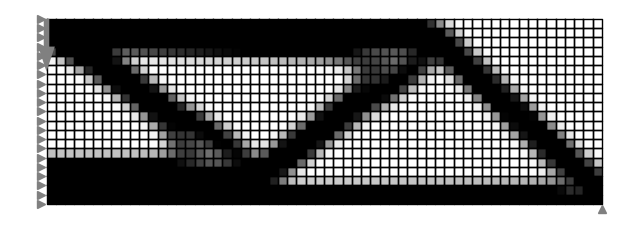
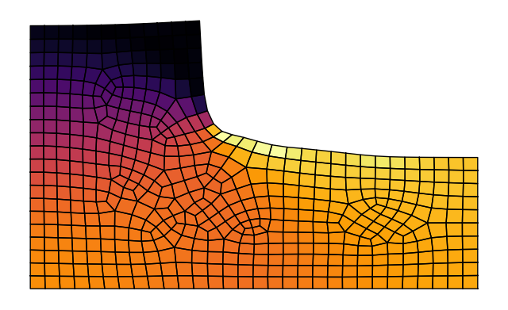
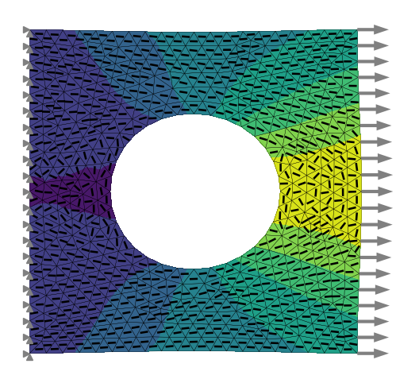
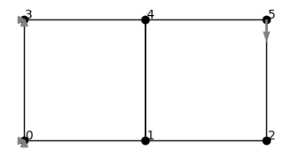

[](https://opensource.org/licenses/MIT)

[](https://pypi.org/project/torch-fem/)
[](https://github.com/psf/black)
[](https://mybinder.org/v2/gh/meyer-nils/torch-fem/HEAD)


# torch-fem: differentiable linear elastic finite elements

Simple finite element assemblers for linear elasticity with PyTorch. The advantage of using PyTorch is the ability to efficiently compute sensitivities and use them in structural optimization. 

## Examples
The subdirectory `examples->basic` contains a couple of Jupyter Notebooks demonstrating the use of torch-fem for trusses, planar problems, shells and solids. 


*Simple cantilever beam with second order triangles*

The subdirectory `examples->optimization` demonstrates the use of torch-fem for optimization of structures (e.g. topology optimization, composite orientation optimization).


*Simple topology optimization of a MBB beam*


*Simple shape optimization of a fillet*

 
*Simple fiber orientation optimization of a plate with a hole*

## Installation
Your may install torch-fem via pip with
```
pip install torch-fem
```


## Minimal code
This is a minimal example of how to use torch-fem to solve a simple cantilever problem. 

```python
from torchfem import Planar
from torchfem.materials import IsotropicPlaneStress

# Define a (minimal) mesh 
nodes = torch.tensor([[0.0, 0.0], [1.0, 0.0], [2.0, 0.0], [0.0, 1.0], [1.0, 1.0], [2.0, 1.0]])
elements = torch.tensor([[0, 1, 4, 3], [1, 2, 5, 4]])

# Apply a load at the tip
tip = (nodes[:, 0] == 2.0) & (nodes[:, 1] == 1.0)
forces = torch.zeros_like(nodes)
forces[tip, 1] = -1.0

# Constrained displacement at left end
left = nodes[:, 0] == 0.0
displacements = torch.zeros_like(nodes)
constraints = torch.zeros_like(nodes, dtype=bool)
constraints[left, :] = True

# Thickness
thickness = torch.ones(len(elements))

# Material model (plane stress)
material = IsotropicPlaneStress(E=1000.0, nu=0.3)

# Create model
cantilever = Planar(nodes, elements, forces, displacements, constraints, thickness, material.C())
```
This creates a minimal planar FEM model:



```python
# Solve
u, f = cantilever.solve()

# Plot
cantilever.plot(u, node_property=torch.norm(u, dim=1), node_markers=True)
```
This solves the model and plots the result:


